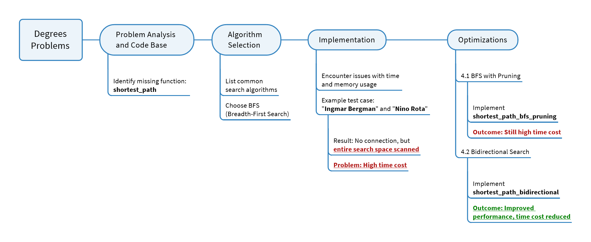

# Report on Approach to Solving the Degrees of Separation Problem



## 1. Problem Analysis and Code Base

### Problem
- Requirement: Find the shortest path between two actors through shared movies.
- Missing function: `shortest_path` to calculate the shortest connection.
- Goal: Identify intermediary steps between two actors through movie connections.

### Code Base

#### File `util.py`
- **Purpose**: Provides essential data structures and helper functions for managing the search process in finding the shortest connection between two actors through shared movies.
- **Components**:
  - **`Node`**: Represents a single search node with key information:
    - `state`: Stores the `person_id` of the actor at this point in the search.
    - `parent`: References the previous `Node` that led to this actor, allowing path reconstruction from the target back to the source.
    - `action`: Holds the `movie_id` that connects this actor to their `parent` actor, representing the shared movie.
  - **`StackFrontier`**: Manages nodes in a Last-In-First-Out (LIFO) structure, suitable for depth-first search where recently added nodes are explored first.
  - **`QueueFrontier`**: Manages nodes in a First-In-First-Out (FIFO) structure, ideal for breadth-first search. Ensures that nodes are explored in the order they were added, making it suitable for finding the shortest path in an unweighted graph, like connecting actors through movies.


#### File `degrees.py`
- **Purpose**: Executes the main functionality of the program.
- **Functions and roles**:
  - `load_data`: Loads actor, movie, and connection data.
  - `person_id_for_name`: Finds actor ID from the name.
  - `neighbors_for_person`: Retrieves a list of connected actors through shared movies.
  - **Required function**: `shortest_path` – this function will be responsible for finding the shortest path between two actors using data from the helper functions.

## 2. Algorithm Selection

### Common Search Algorithms

| Algorithm                    | Description                                                                                   | Limitations                                                             |
|------------------------------|-----------------------------------------------------------------------------------------------|-------------------------------------------------------------------------|
| **Depth-First Search (DFS)** | Explores each branch to its deepest level before backtracking.                                | Not suitable for shortest path due to potential depth issues.           |
| **Breadth-First Search (BFS)**| Explores nodes level by level, guaranteeing shortest path in unweighted graphs.             | Can be memory-intensive for large graphs.                               |
| **Greedy Best-First Search** | Chooses the path that appears closest to the target using a heuristic.                        | Does not guarantee shortest path in unweighted graphs.                  |
| **A***                       | Uses a heuristic to estimate cost to target, suitable for weighted graphs.                    | More effective in cases with defined heuristic costs, not ideal here.   |
| **Minimax**                  | Used in adversarial games to minimize the possible loss, assuming optimal opponent behavior. | Not suitable for shortest path; primarily for decision-making in games. |
| **Alpha-Beta Pruning**       | Optimizes Minimax by pruning unneeded branches, reducing computation in game trees.           | Only applicable in adversarial search, not pathfinding.                 |

### Reason for Choosing BFS
| Factor                       | Explanation                                                                                      |
|------------------------------|--------------------------------------------------------------------------------------------------|
| **Shortest Path Guarantee**  | BFS ensures that the first path to reach the target is the shortest in unweighted graphs.       |
| **Level-by-Level Processing**| Nodes are explored level by level, preventing deeper, longer paths from being selected first.    |
| **Simplicity**               | Straightforward to implement without additional heuristics or complex structures.                |


## 3. Initial Implementation

### Approach
The `shortest_path` function was implemented using **Breadth-First Search (BFS)**. BFS explores nodes level-by-level to ensure the shortest path is found first. Nodes are added to a queue and processed until the target node is reached.

### Flow Chart


### Implementation

```python
from util import Node, QueueFrontier

def shortest_path_bfs_simple(source, target):
    """
    Finds the shortest path between two nodes (source and target) using BFS.

    Args:
        source: Starting node (person_id of source actor)
        target: Target node (person_id of target actor)

    Returns:
        List of (movie_id, person_id) pairs representing the shortest path,
        or None if no path exists.
    """
    # Step 1: Initialize frontier with the starting node
    start = Node(state=source, parent=None, action=None)
    frontier = QueueFrontier()
    frontier.add(start)

    # Step 2: Create a set to keep track of explored nodes
    explored = set()

    # Step 3: Loop through the frontier
    while not frontier.empty():
        # Remove the node from the frontier
        node = frontier.remove()

        # Check if target is reached
        if node.state == target:
            # Build the path by backtracking through parent nodes
            path = []
            while node.parent is not None:
                path.append((node.action, node.state))
                node = node.parent
            path.reverse()  # Reverse path to go from source to target
            return path

        # Mark the current node as explored
        explored.add(node.state)

        # Expand node and add neighbors to frontier if not explored
        for movie_id, person_id in neighbors_for_person(node.state):
            if not frontier.contains_state(person_id) and person_id not in explored:
                child = Node(state=person_id, parent=node, action=movie_id)
                frontier.add(child)

    # Return None if no path found
    return None
```

**Explanation**:
- **Initialize**: Start with the `source` node in the frontier and an empty `explored` set to track visited nodes.
- **Loop until target**: Remove the first node from the queue, check if it’s the target.
- **Path reconstruction**: If the target is reached, build the path by following the `parent` pointers from the target back to the source.
- **Explore neighbors**: For each neighbor (connected actor), add it to the frontier if it hasn’t been explored.
- **No path case**: If the queue is empty and the target hasn’t been reached, return `None`.

### Issues Encountered
During testing, high time and memory usage were observed in some cases:
- **Test Case**: Finding the connection between "**Ingmar Bergman**" and "**Nino Rota**".
  - **Problem**: No direct or indirect connection exists between these two actors, but BFS exhaustively scans the entire search space.
  - **Outcome**: Excessive time was required to conclude the absence of a path, highlighting a need for optimization in cases where no path exists.
  - **Time Consume**: 6 hours to find no connection between "**Ingmar Bergman**" and "**Nino Rota**".

## 4. Optimizations
Due to the inefficiencies observed in the initial BFS implementation, we applied two main optimization strategies to improve performance.

### 4.1 BFS with Pruning
- **Idea**: Use pruning to avoid redundant paths and reduce the search space by only expanding nodes that can lead to a shorter or unique path.
- **Implement**:
  - **Code**:
    ```python
    def shortest_path_bfs_pruning(source, target):
        start = Node(state=source, parent=None, action=None)
        frontier = QueueFrontier()
        frontier.add(start)

        explored = set()
        shortest_paths = {source: 0}

        while not frontier.empty():
            node = frontier.remove()

            if node.state == target:
                path = []
                while node.parent is not None:
                    path.append((node.action, node.state))
                    node = node.parent
                path.reverse()
                return path

            explored.add(node.state)

            for movie_id, person_id in neighbors_for_person(node.state):
                new_path_length = shortest_paths[node.state] + 1
                if person_id not in explored and (person_id not in shortest_paths or new_path_length < shortest_paths[person_id]):
                    shortest_paths[person_id] = new_path_length
                    child = Node(state=person_id, parent=node, action=movie_id)
                    frontier.add(child)

        return None
    ```
  - **Explanation**:
    - A `shortest_paths` dictionary is used to track the minimum known path to each node.
    - Each neighbor is only added to the frontier if it leads to a shorter or new path. This effectively "prunes" redundant paths and reduces the number of nodes expanded.
- **Outcome**: 
  - Pruning reduced some redundant searches, but for larger networks with no connections, the time cost remained high.
- **Example Test Case**:
  - **Test Case**: Finding the connection between "**Ingmar Bergman**" and "**Nino Rota**".
    
  - **Execution Time**: 10 minutes to find no connection between "**Ingmar Bergman**" and "**Nino Rota**".

### 4.2 Bidirectional Search
- **Idea**: Perform BFS from both the source and target nodes simultaneously, reducing the search space by half and meeting at an intersection point.
- **Implement**:
  - **Code**:
    ```python
    def shortest_path_bidirectional(source, target):
        start_frontier, goal_frontier = initialize_frontiers(source, target)
        start_explored, goal_explored = initialize_explored_dicts(source, target)

        while not start_frontier.empty() and not goal_frontier.empty():
            result = search_step(start_frontier, start_explored, goal_explored, "forward")
            if result:
                return result

            result = search_step(goal_frontier, goal_explored, start_explored, "backward")
            if result:
                return result

        return None

    def initialize_frontiers(source, target):
        start_frontier = QueueFrontier()
        goal_frontier = QueueFrontier()
        start_frontier.add(Node(state=source, parent=None, action=None))
        goal_frontier.add(Node(state=target, parent=None, action=None))
        return start_frontier, goal_frontier

    def initialize_explored_dicts(source, target):
        start_explored = {source: None}
        goal_explored = {target: None}
        return start_explored, goal_explored

    def search_step(frontier, explored, other_explored, direction):
        if frontier.empty():
            return None

        node = frontier.remove()
        explored[node.state] = node

        if node.state in other_explored:
            path = build_path(node, other_explored[node.state], direction)
            return path

        for movie_id, person_id in neighbors_for_person(node.state):
            if person_id not in explored and not frontier.contains_state(person_id):
                child = Node(state=person_id, parent=node, action=movie_id)
                frontier.add(child)

        return None

    def build_path(node_forward, node_backward, direction):
        path_forward = []
        node = node_forward
        while node.parent is not None:
            path_forward.append((node.action, node.state))
            node = node.parent
        path_forward.reverse()

        path_backward = []
        node = node_backward
        while node.parent is not None:
            path_backward.append((node.action, node.state))
            node = node.parent

        if direction == "forward":
            return path_forward + path_backward
        else:
            return path_backward + path_forward
    ```
  - **Explanation**:
    - **initialize_frontiers**: Sets up two search frontiers, one for the source and one for the target.
    - **search_step**: Expands nodes in each direction and checks if the two searches intersect.
    - **build_path**: Combines paths when an intersection is found, creating a complete route from source to target.
- **Outcome**: Bidirectional Search effectively halved the search space, significantly improving time and memory efficiency, especially in large networks or cases with no connection.
- **Example Test Case**:
  - **Test Case**: Finding the connection between "**Ingmar Bergman**" and "**Nino Rota**".
    
  - **Execution Time**: 1 second to find no connection between "**Ingmar Bergman**" and "**Nino Rota**".


## Conclusion
The final `shortest_path_bidirectional` function provided an optimal solution, addressing both time and memory issues. Bidirectional Search proved to be the best approach for this problem due to its efficiency in large, sparse graphs, where connections may not exist.
